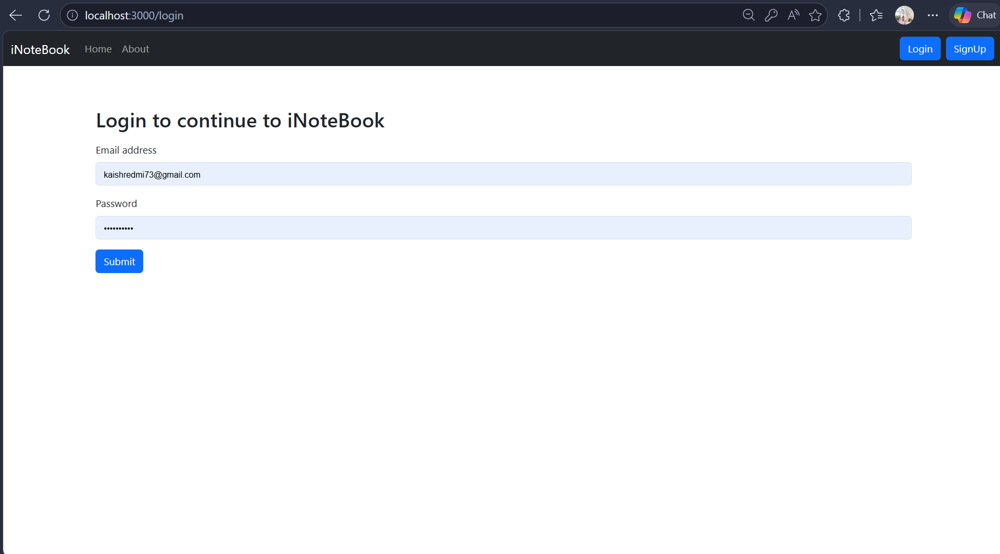
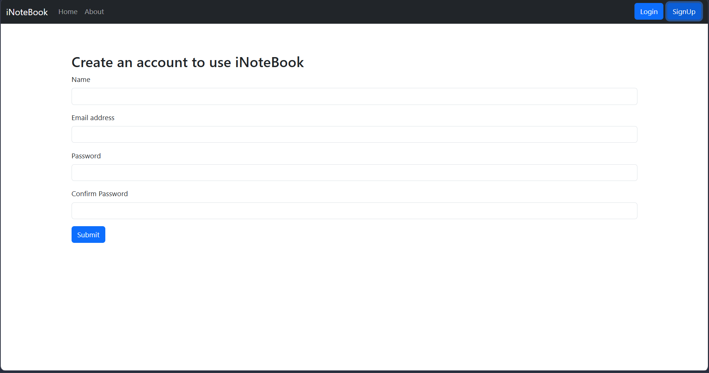

# 📝 iNotebook

> A full-stack cloud-based note-taking application built with React.js and a custom REST API.

iNotebook is a full-stack note management application that allows users to securely create, view, update, and delete their personal notes.

This project was built while learning React.js and full-stack development through the **CodeWithHarry React.js playlist**, with a custom backend and personal APIs for authentication and note management.

---

## 🚀 Features

- 🔐 User Registration & Authentication
- 🔑 Login using user credentials
- 👤 Fetch authenticated user data
- 📝 Create new notes
- 📚 Fetch all notes belonging to the logged-in user
- ✏️ Update existing notes
- 🗑️ Delete notes
- 🔒 JWT-based authentication
- 🌐 Custom REST APIs
- ⚛️ React Context API for state management
- 📱 Responsive user interface
- ⚡ Frontend and backend can be started together

---

## 🛠️ Tech Stack

### Frontend

- **React.js**
- **JavaScript**
- **React Router**
- **Context API**
- **HTML5**
- **CSS3**
- **Bootstrap**

### Backend

- **Node.js**
- **Express.js**
- **MongoDB**
- **Mongoose**
- **JWT (JSON Web Token)**
- **bcrypt.js**

### Development Tools

- **VS Code**
- **Thunder Client**
- **Git & GitHub**
- **Create React App**
- **Nodemon**

---

## 🏗️ Project Structure

```text
iNotebook/
│
├── backend/
│   ├── models/
│   ├── routes/
│   ├── middleware/
│   └── index.js
│
├── public/
│
├── src/
│   ├── components/
│   │   ├── About.js
│   │   ├── AddNote.js
│   │   ├── Alert.js
│   │   ├── Home.js
│   │   ├── Login.js
│   │   ├── Navbar.js
│   │   ├── NoteItem.js
│   │   ├── Notes.js
│   │   └── Signup.js
│   │
│   ├── context/
│   │   └── notes/
│   │       ├── NoteContext.js
│   │       └── NoteState.js
│   │
│   ├── App.js
│   ├── App.css
│   ├── index.js
│   └── index.css
│
├── .gitignore
├── package.json
├── package-lock.json
└── README.md
```

---

## 🔐 Authentication

iNotebook uses **JWT (JSON Web Token)** based authentication.

### Authentication Flow

```text
User
 │
 ├── Signup
 │      ↓
 │   Create User API
 │
 └── Login
        ↓
   Login API
        ↓
   JWT Token
        ↓
   Token stored on client
        ↓
   Token sent with protected requests
        ↓
   Backend verifies token
        ↓
   User-specific data returned
```

Passwords are handled using **bcrypt**, while JWT is used to authenticate protected API requests.

---

# 🌐 API Structure

The project uses custom REST APIs for authentication and note management.

## 🔑 Authentication APIs

| Method | Endpoint | Description | Auth |
|---|---|---|---|
| `POST` | `/api/auth/createuser` | Create a new user | No |
| `POST` | `/api/auth/login` | Login using credentials | No |
| `GET` | `/api/auth/getuser` | Get authenticated user data | Yes |

---

## 📝 Notes APIs

| Method | Endpoint | Description | Auth |
|---|---|---|---|
| `GET` | `/api/notes/fetchallnotes` | Fetch all user notes | Yes |
| `POST` | `/api/notes/addnote` | Create a new note | Yes |
| `PUT` | `/api/notes/updatenote/:id` | Update an existing note | Yes |
| `DELETE` | `/api/notes/deletenote/:id` | Delete a note | Yes |

---

## 📌 Add Note Example

```http
POST /api/notes/addnote
```

Example request body:

```json
{
  "title": "My Note",
  "description": "This is my note.",
  "tag": "Personal"
}
```

---

## ✏️ Update Note Example

```http
PUT /api/notes/updatenote/:id
```

The `:id` represents the unique ID of the note that needs to be updated.

---

## 🗑️ Delete Note Example

```http
DELETE /api/notes/deletenote/:id
```

The `:id` represents the unique ID of the note that needs to be deleted.

---

# 🧪 API Testing

The APIs were tested during development using **Thunder Client**.

### API Collection

```text
iNotebook
│
├── Authentication
│   ├── POST  User login using credentials
│   ├── GET   Get User data
│   └── POST  Create a new User
│
└── Notes
    ├── GET     Fetch all notes
    ├── POST    Add note
    ├── PUT     Update Note
    └── DELETE  Delete Note
```

Thunder Client was used to test authentication, protected routes, and CRUD operations before and during frontend integration.

---

# ⚙️ Installation & Setup

## 1. Clone the Repository

```bash
git clone https://github.com/kaish10-hub/iNotebook.git
```

```bash
cd iNotebook
```

---

## 2. Install Frontend Dependencies

From the project root:

```bash
npm install
```

---

## 3. Install Backend Dependencies

```bash
cd backend
npm install
```

Then return to the project root:

```bash
cd ..
```

---

# 🔑 Environment Variables

Create a `.env` file inside the `backend` directory.

Example:

```env
MONGO_URI=your_mongodb_connection_string
JWT_SECRET=your_jwt_secret
PORT=5000
```

> Never commit your `.env` file or expose your MongoDB credentials and JWT secret publicly.

---

# ▶️ Running the Project

## Start Frontend

From the project root:

```bash
npm start
```

The React application will run on:

```text
http://localhost:3000
```

---

## Start Backend

Open another terminal and navigate to the backend:

```bash
cd backend
```

Then run:

```bash
nodemon index.js
```

---

## ⚡ Run Frontend & Backend Together

The project includes a script using `concurrently`.

From the project root:

```bash
npm run both
```

This starts the frontend and backend together.

---

# 🔄 Application Workflow

```text
                    ┌───────────────┐
                    │     User      │
                    └───────┬───────┘
                            │
                 ┌──────────┴──────────┐
                 │                     │
              Signup                  Login
                 │                     │
                 └──────────┬──────────┘
                            ▼
                    ┌───────────────┐
                    │ Authentication│
                    │      API      │
                    └───────┬───────┘
                            │
                         JWT Token
                            │
                            ▼
                    ┌───────────────┐
                    │ React Frontend│
                    └───────┬───────┘
                            │
                      Notes API Calls
                            │
                            ▼
                    ┌───────────────┐
                    │ Express/Node  │
                    │    Backend    │
                    └───────┬───────┘
                            │
                            ▼
                    ┌───────────────┐
                    │    MongoDB    │
                    └───────────────┘
```

---

# 🔄 CRUD Operations

The application supports complete CRUD functionality for notes.

| Operation | API | Purpose |
|---|---|---|
| **Create** | `POST /api/notes/addnote` | Add a new note |
| **Read** | `GET /api/notes/fetchallnotes` | Fetch notes |
| **Update** | `PUT /api/notes/updatenote/:id` | Edit a note |
| **Delete** | `DELETE /api/notes/deletenote/:id` | Delete a note |

---

# 🧠 Key Concepts Learned

This project helped me practice several important full-stack development concepts.

### React

- Components
- Props
- State Management
- `useState`
- `useEffect`
- React Router
- Context API
- Controlled Forms
- Conditional Rendering
- API Integration using `fetch`

### Backend

- Node.js
- Express.js
- REST API development
- API routing
- Middleware
- Authentication middleware
- JWT authentication
- Password hashing
- MongoDB integration
- Mongoose models and schemas

### Full-Stack Integration

- Connecting React frontend with REST APIs
- Sending authentication tokens
- Handling protected APIs
- CRUD operations
- Managing API responses
- Connecting frontend state with backend data

---

# 📸 Screenshots

Add screenshots of the application inside a `screenshots` folder.

Recommended structure:

```text
screenshots/
├── login.png
├── signup.png
├── home.png
├── add-note.png
└── api-testing.png
```

Then add them to this section:

### Login



### Signup



### Notes Dashboard


### Add Note


### API Testing


> If the screenshots folder is not present in the repository yet, remove this section or add the screenshots later.

---

# 📚 Learning Source

This project was developed while following the **React.js playlist by CodeWithHarry**.

The project helped me move from learning individual React concepts to building a complete full-stack application involving:

```text
React
  ↓
Context API
  ↓
REST APIs
  ↓
Node.js + Express
  ↓
MongoDB
  ↓
JWT Authentication
  ↓
CRUD Operations
  ↓
Complete Full-Stack Application
```

---

# 🚀 Future Improvements

Possible improvements for future versions:

-  Dark Mode
-  Search Notes
-  Note Categories
-  Rich Text Editor
-  Password Reset
-  Email Verification
-  Profile Management
-  Pagination
-  Better form validation
-  Improved error handling
-  Production deployment
-  Improved mobile UI

---

# 💻 Project Status

🟢 **Completed**

The core authentication and note-management functionality has been implemented, including:

- User registration
- User login
- JWT authentication
- Protected APIs
- User data retrieval
- Create notes
- Read notes
- Update notes
- Delete notes

---

# 👨‍💻 Author

## Mohd Kaish

**CSE Student | Aspiring Full-Stack Web Developer | DSA Enthusiast**

I'm learning and building projects with modern web technologies while strengthening my Data Structures & Algorithms skills.

### Connect With Me

- **GitHub:** [kaish10-hub](https://github.com/kaish10-hub)
- **LinkedIn:** [Mohd Kaish](https://www.linkedin.com/in/mohd-kaish10/)
- **LeetCode:** [kaish_n112](https://leetcode.com/u/kaish_n112/)

---

⭐ If you found this project useful, consider giving it a star!

Thanks for checking out **iNotebook** 🚀
